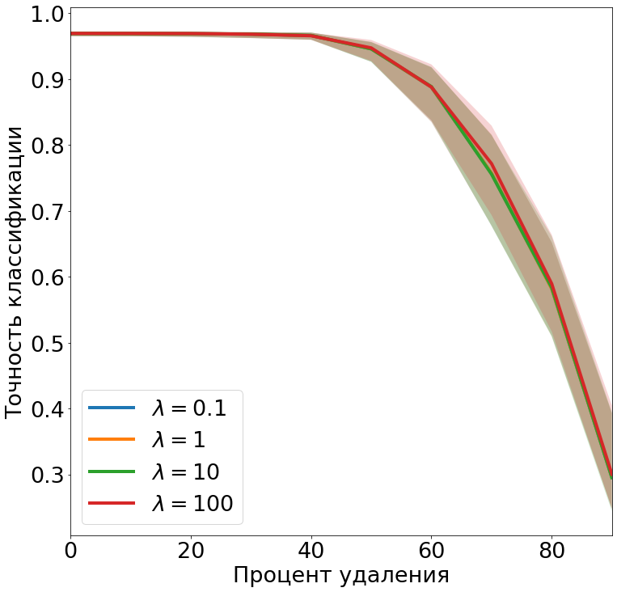

# Grebenkova-BS-Thesis
Репозиторий для бакалаврского диплома Гребеньковой О.С.

### Тема: Порождение моделей заданной сложности с использованием байесовских гиперсетей 

### Научный руководитель: Бахтеев Олег Юрьевич

В работе исследуется задача построения модели глубокого обучения. Предлагается способ контроля ее сложности. 
Под сложностью модели понимается минимальная длина описания, минимальное количество информации, которое требуется для передачи информации о модели и о выборке.
Предлагается метод оптимизации параметров модели, основанный на представлении модели глубокого обучения в виде гиперсети с использованием байесовского подхода.
Под гиперсетью понимается модель, которая порождает параметры оптимальной модели. 
Вводятся вероятностные предположения о распределении параметров модели глубокого обучения. 
Предлагается алгоритм, максимизирующий нижнюю вариационную оценку байесовской обоснованности модели. 
Вариационная оценка рассматривается как условная величина, зависящая от требуемой сложности модели. Для анализа качества предлагаемого алгоритма проводятся эксперименты на выборке MNIST, CIFAR10.


### Демо

Данный репозиторий может быть перенесен на ваш машину следующей командой:

```
gh repo clone Intelligent-Systems-Phystech/Grebenkova-BS-Thesis
```


### Requirements

```
Python >= 3.5.5, PyTorch == 1.7.1, torchvision == 0.8.2
```


### Running the Experiments

Папка `code/` содержит код экспериментов.
В результате последовательного запуска ячеек из ([ноутбука](https://github.com/Intelligent-Systems-Phystech/Grebenkova-BS-Thesis/blob/main/code/mnist_hypernets.ipynb) можно повторить следующие результаты:

<p align="center">
Зависимость точности классификации от процента удаленных параметров для базового эксперимента
</p>


<p align="center">
Зависимость точности классификации от процента удаленных параметров для базового эксперимента с низкоранговой гиперсетью
 </p>
 



<p align="center">
Зависимость точности классификации от процента удаленных параметров для базового эксперимента с линейной гиперсетью
 </p>
 


<p align="center">
Аналогичные зависимости для экспериментоа с вариационной сетью и ее вариантами с гиперсетями
  </p>
 

  
  

